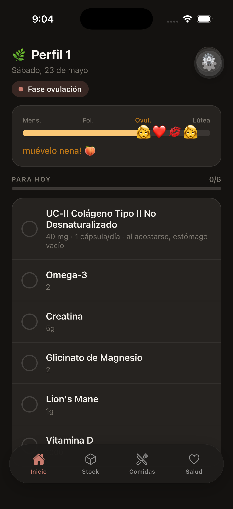
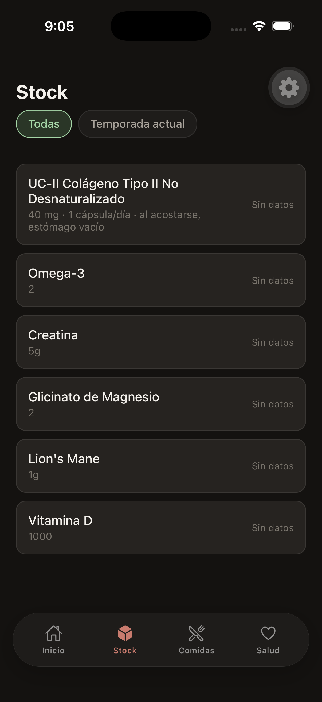
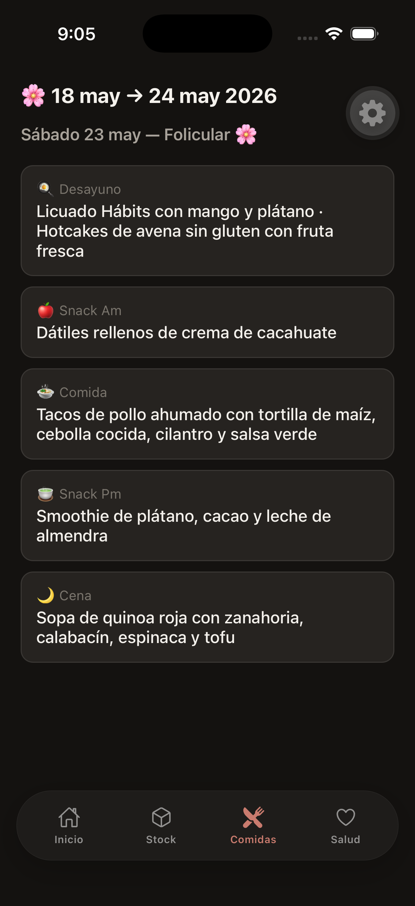

# La Comuna App

[](https://github.com/labsistemasconscientes/comuna-app/actions/workflows/ci.yml)
[](LICENSE)

App móvil **iOS** de seguimiento de suplementos basada en fases del ciclo menstrual. Sincroniza con **Notion** como fuente de verdad y guarda datos localmente en **SQLite**.

**Mantenido por [Laboratorio de Sistemas Conscientes](https://github.com/labsistemasconscientes).**

> **Aviso de salud:** esta app no sustituye consejo médico ni nutricional. HealthKit y Notion son herramientas personales; consulta a tu profesional de salud antes de cambiar suplementos o tratamientos.

> **Expo Go no funciona:** HealthKit y el dev client exigen build nativo. Usa `npx expo run:ios` (simulador o dispositivo).

> **Plataforma:** solo **iOS** es mantenido activamente. ¿Android? Ver [docs/ANDROID_CONTRIBUTING.md](docs/ANDROID_CONTRIBUTING.md).

## Empieza con el template de Notion

1. Clona el [template oficial en Notion Marketplace](https://www.notion.com/es/templates/comuna-app).
2. Crea una integración en [Notion Developers](https://www.notion.so/my-integrations) e invita el workspace del template.
3. Copia los IDs a `.env` — detalle en [docs/NOTION_SETUP.md](docs/NOTION_SETUP.md).

## Quick start

```bash
npm install
cp .env.example .env          # completar NOTION_* y opcionales
cp eas.json.example eas.json  # opcional: EAS Build
npx expo run:ios              # no uses Expo Go
```

Backend opcional (stock compartido):

```bash
cp backend/.env.example backend/.env
docker compose up -d            # Mongo local — ver docker-compose.yml
cd backend && npm install && npm run dev
```

## Documentación

| Doc                                                          | Contenido              |
| ------------------------------------------------------------ | ---------------------- |
| [docs/ARCHITECTURE.md](docs/ARCHITECTURE.md)                 | Capas, flujos, specs   |
| [docs/FORK_SETUP.md](docs/FORK_SETUP.md)                     | Checklist post-fork    |
| [docs/NOTION_SETUP.md](docs/NOTION_SETUP.md)                 | Template + variables   |
| [docs/ANDROID_CONTRIBUTING.md](docs/ANDROID_CONTRIBUTING.md) | Contribuciones Android |
| [CONTRIBUTING.md](CONTRIBUTING.md)                           | Cómo contribuir        |
| [SECURITY.md](SECURITY.md)                                   | Privacidad y reportes  |
| [TRADEMARK.md](TRADEMARK.md)                                 | Marca vs código GPL    |
| [CHANGELOG.md](CHANGELOG.md)                                 | Historial de versiones |

## Variables de entorno (app)

| Variable                       | Requerida | Descripción                           |
| ------------------------------ | --------- | ------------------------------------- |
| `NOTION_API_KEY`               | Sí        | Token de integración                  |
| `NOTION_SUPPLEMENTS_DB_ID`     | Sí        | DB de suplementos                     |
| `NOTION_PHASES_PAGE_ID`        | Sí        | Página con tabla de fases             |
| `NOTION_MEAL_PREP_HUB_PAGE_ID` | No        | Hub **Comidas Activas**               |
| `EXPO_PUBLIC_BACKEND_URL`      | No        | API stock compartido                  |
| `BACKEND_API_KEY`              | No        | Mismo valor que `API_KEY` del backend |
| `SENTRY_DSN`                   | No        | Errores en release                    |
| `POSTHOG_*`                    | No        | Analítica de producto                 |

Ver [`.env.example`](.env.example) y [backend/.env.example`](backend/.env.example).

## Capturas

Capturas del simulador iOS (dev build) con datos de ejemplo del maintainer vía Notion.

| Inicio                          | Stock                           | Comidas                             |
| ------------------------------- | ------------------------------- | ----------------------------------- |
|  |  |  |

## Scripts

```bash
npm test               # version:check + Jest
npm run ios            # expo run:ios
npm run db:studio      # Drizzle Studio
npm run version:sync   # package.json → app.json
```

## Licencia

Código bajo [GPL-3.0](LICENSE). El nombre **La Comuna** y assets gráficos pueden tener restricciones de marca — ver [TRADEMARK.md](TRADEMARK.md).
