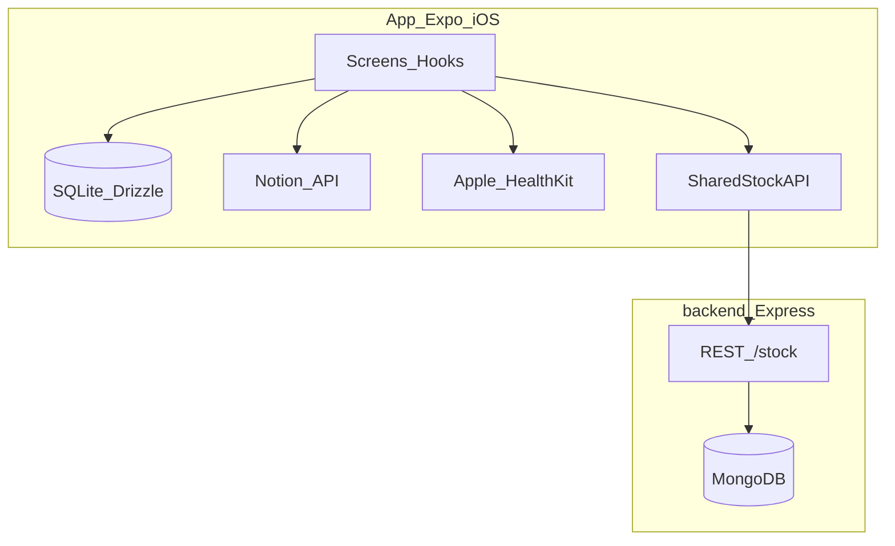

# Arquitectura — La Comuna App

Overview del monorepo para forks y contribuidores. Specs detalladas en [`specs/README.md`](specs/README.md).

## Propósito

Seguimiento diario de **suplementos** alineados a la **fase del ciclo menstrual**. **Notion** es la fuente de verdad (suplementos, fases, meal prep opcional). **SQLite** (Drizzle) permite uso offline. En iOS, **HealthKit** puede refinar la fase y escribir de vuelta en Notion.

## Diagrama

## Capas (app)

| Capa | Ubicación | Rol |
|------|-----------|-----|
| API Notion | `src/api/notion.ts` | Suplementos, fases, meal prep, restock |
| API HealthKit | `src/api/healthkit.ts` | Señales de ciclo (solo iOS) |
| API stock compartido | `src/api/sharedStock.ts` | Suplementos Persona **Ambas** |
| DB local | `src/db/schema.ts` | `supplements`, `daily_logs`, `stock`, `phases`, `cycle_states` |
| Hooks | `src/hooks/` | Un dominio por hook (`useSupplements`, `useHealthData`, …) |
| Perfiles | `src/config/profiles.ts` | Máx. 2 perfiles (`profile_1`, `profile_2`); overrides en `profiles.local.ts` |
| Observabilidad | `src/utils/observability.ts` | Sentry (errores); PostHog (producto) |

## Navegación

Tabs en [`App.tsx`](../App.tsx) vía `activeTab`: Inicio, Stock, Comidas, Salud. **Perfil** no está en la barra inferior; se abre con ⚙️ en Inicio.

## Backend opcional

Express + MongoDB en [`backend/`](../backend/). Endpoints `/stock` para inventario compartido. Ver [`specs/backend-stock-api.md`](specs/backend-stock-api.md).

## Build y release

- **iOS:** EAS + dev client; `npm run version:sync` alinea `package.json` → `app.json`.
- **Android:** bloque en `app.json` por Expo; sin releases del mantenedor — ver [`ANDROID_CONTRIBUTING.md`](ANDROID_CONTRIBUTING.md).

## Parches npm (`patches/`)

`@kingstinct/react-native-healthkit` incluye un patch aplicado en `postinstall` vía `patch-package`. Revisa el diff en `patches/` si actualizas la dependencia.

## Plataforma

El mantenedor desarrolla y publica **solo iOS** (TestFlight). HealthKit no existe en Android; la pestaña Salud requiere degradación clara en forks Android.

## Mapa de specs

Índice completo: [`specs/README.md`](specs/README.md). Destacados:

- HealthKit sync: `specs/healthkit-cycle-sync.md`
- Stock + Notion restock: `specs/stock-restock-notion.md`
- PostHog / Sentry: `specs/posthog-analytics.md`
- Release: `specs/release-versioning.md`
- Perfiles: `specs/user-selected-persistence.md`
